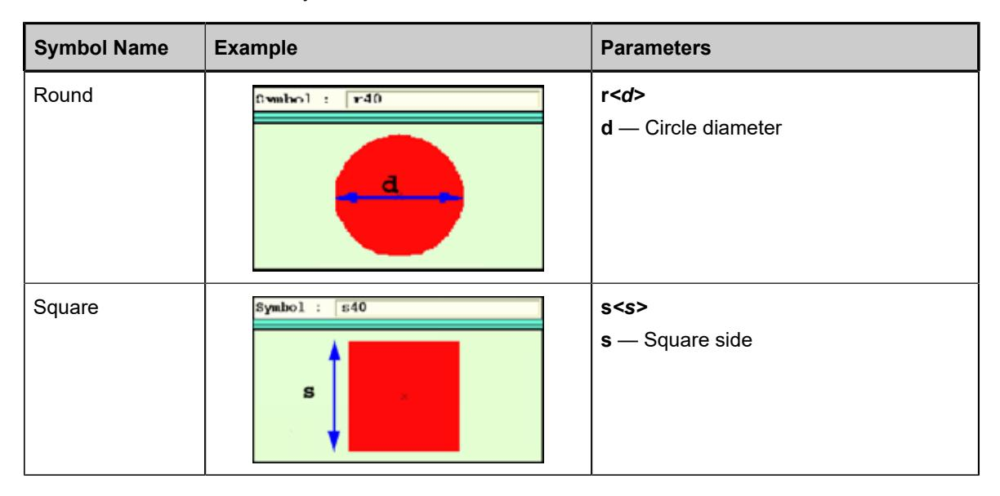
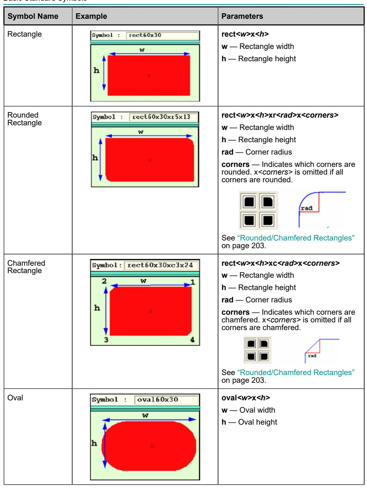
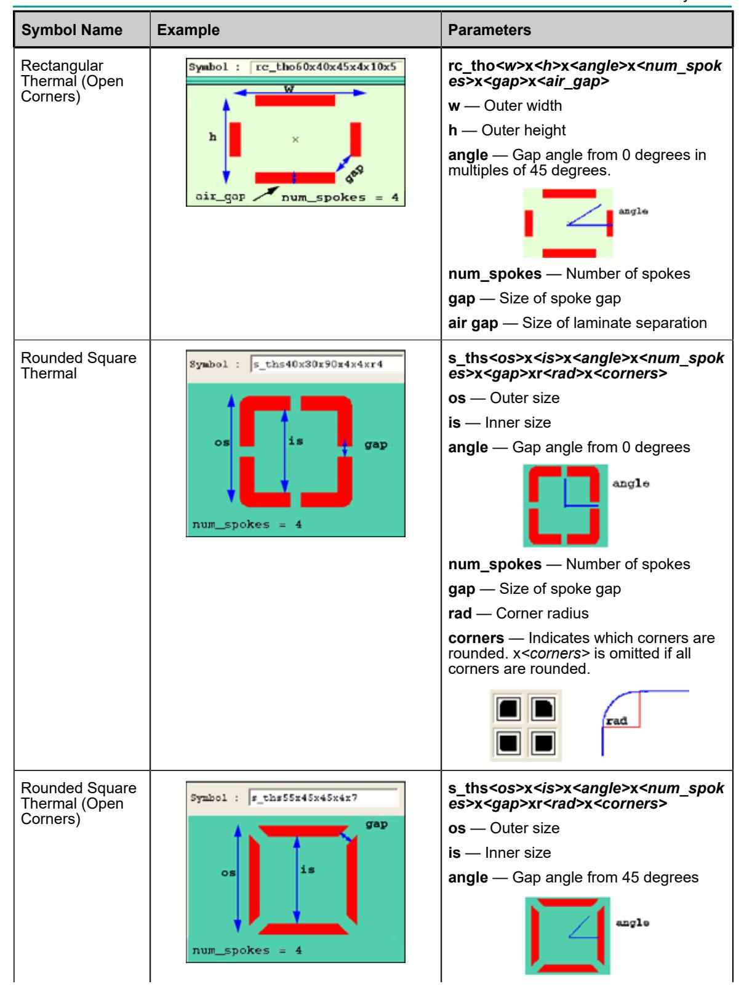
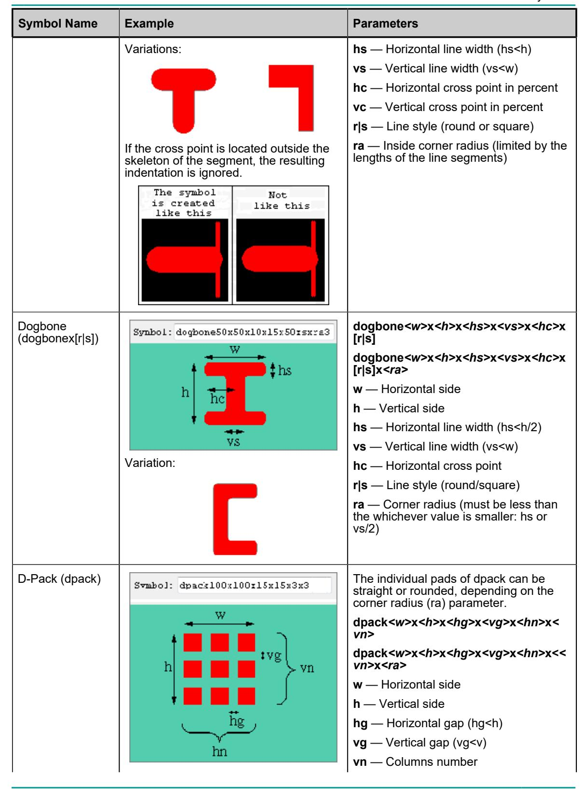
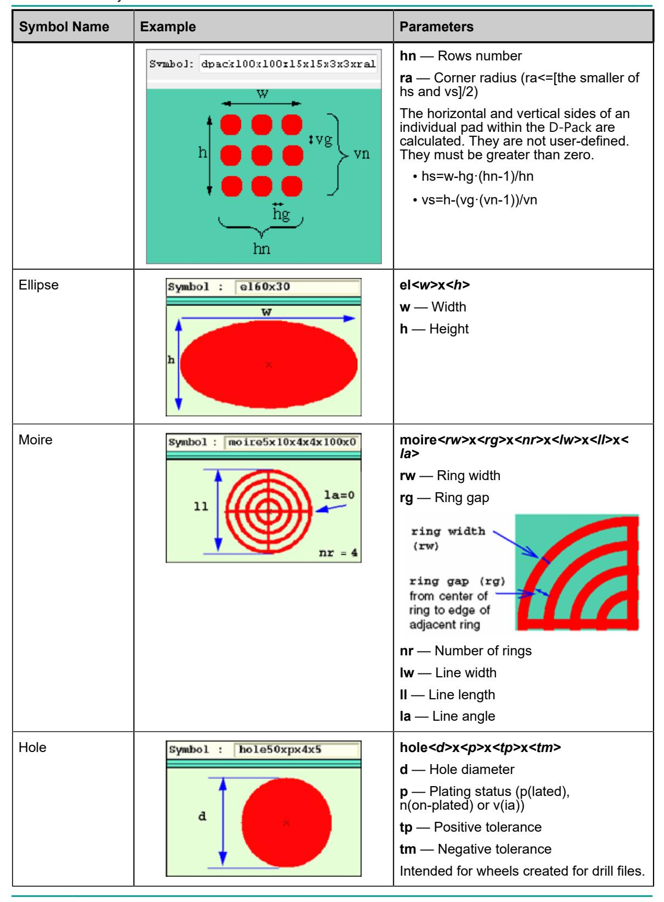

## **Appendix A Standard ODB++ Symbols**

A symbol is one of the geometric primitives supported by ODB++ described here, or a combination of them. They are defined by the parameters: width, height, radius, diameter, spokes, gap, angle, size and corner. The corners of rounded or chamfered rectangles or thermals are specified in ascending order moving counter-clockwise—starting from the top-right corner.

For an example of a symbol with chamfered corners, see "Rounded/Chamfered Rectangles"on page 203.

All symbols described in this section are standard (system) symbols. User defined symbols are defined as described in "symbols (User-Defined Symbols)"on page 92.

Basic Standard Symbols Symbols Suitable for Solder Stencil Design Other Symbol Information Obsolete Symbols

## **Basic Standard Symbols**

These are the basic standard symbols.

| Symbol Name             | Example | Parameters                                                                                   |
|-------------------------|---------|----------------------------------------------------------------------------------------------|
| Diamond                 |         | di <w>x<h> w — Diamond width h — Diamond height</h></w>                              |
| Octagon                 |         | oct <w>x<h>x<r> w — Octagon width h — Octagon height r — Corner size</r></h></w> |
| Round Donut             |         | donut_r <od>x<id> od — Outer diameter id — Inner diameter</id></od>                  |
| Square Donut            |         | donut_s <od>x<id> od — Outer diameter id — Inner diameter</id></od>                  |
| Square / Round Donut |         | donut_sr <od>x<id> od — Outer diameter id — Inner diameter</id></od>                 |

| Symbol Name                | Example | Parameters                                                                                                                                                                                                                                                                               |
|----------------------------|---------|------------------------------------------------------------------------------------------------------------------------------------------------------------------------------------------------------------------------------------------------------------------------------------------|
| Rounded Square Donut    |         | donut_s <od>x<id>xr<rad>x<corners> od — Outer diameter id — Inner diameter rad — Corner radius corners — Indicates which corners are rounded. x<corners> is omitted if all corners are rounded.</corners></corners></rad></id></od>                              |
| Rectangle Donut            |         | donut_rc <ow>x<oh>x<lw> ow — Outer width oh — Outer height lw — Line width</lw></oh></ow>                                                                                                                                                                                    |
| Rounded Rectangle Donut |         | donut_rc <ow>x<oh>x<lw>xr<rad>x<c orners&gt; ow — Outer width oh — Outer height lw — Line width rad — Corner radius corners —Indicates which corners are rounded. x<corners> is omitted if all corners are rounded.</corners></c </rad></lw></oh></ow> |
| Oval Donut                 |         | donut_o <ow>x<oh>x<lw> ow — Outer width oh — Outer height lw — Line width</lw></oh></ow>                                                                                                                                                                                     |

| Symbol Name           | Example | Parameters                                                                                     |
|-----------------------|---------|------------------------------------------------------------------------------------------------|
| Horizontal Hexagon |         | hex_l <w>x<h>x<r> w — Hexagon width h — Hexagon height r — Corner size</r></h></w> |
| Vertical Hexagon      |         | hex_s <w>x<h>x<r> w — Hexagon width h — Hexagon height r — Corner size</r></h></w> |
| Butterfly             |         | bfr <d> d — Diameter</d>                                                                   |
| Square Butterfly      |         | bfs <s> s — Size</s>                                                                       |

| Symbol Name                | Example | Parameters                                                                                                                                                                                                                                                                                                      |
|----------------------------|---------|-----------------------------------------------------------------------------------------------------------------------------------------------------------------------------------------------------------------------------------------------------------------------------------------------------------------|
| Triangle                   |         | tri <base/> x <h> base — Triangle base h — Triangle height</h>                                                                                                                                                                                                                                          |
| Half Oval                  |         | oval_h <w>x<h> w — Width h — Height</h></w>                                                                                                                                                                                                                                                             |
| Round Thermal (Rounded) |         | thr <od>x<id>x<angle>x<num_spokes &gt;x<gap> od — Outer diameter id — Inner diameter angle — Gap angle from 0 degrees num_spokes — Number of spokes gap — Size of spoke gap od and id control the air gap (size of laminate separation).</gap></num_spokes </angle></id></od> |
| Round Thermal (Squared) |         | ths <od>x<id>x<angle>x<num_spokes &gt;x<gap> od — Outer diameter id — Inner diameter angle — Gap angle from 0 degrees</gap></num_spokes </angle></id></od>                                                                                                                                    |

| Symbol Name                      | Example | Parameters                                                                                                                                                                                                                                                                                                                                                     |
|----------------------------------|---------|----------------------------------------------------------------------------------------------------------------------------------------------------------------------------------------------------------------------------------------------------------------------------------------------------------------------------------------------------------------|
|                                  |         | num_spokes — Number of spokes gap — Size of spoke gap od and id control the air gap (size of laminate separation).                                                                                                                                                                                                                                    |
| Square Thermal                   |         | s_ths <os>x<is>x<angle>x<num_spok es&gt;x<gap> os — Outer size is — Inner size angle — Gap angle from 0 degrees num_spokes — Number of spokes gap — Size of spoke gap os and is control the air gap (size of laminate separation).</gap></num_spok </angle></is></os>                                                        |
| Square Thermal (Open Corners) |         | s_tho <od>x<id>x<angle>x<num_spo kes&gt;x<gap> od — Outer diameter id — Inner diameter angle — Gap angle from 0 degrees in increments of 45 degrees num_spokes — Number of spokes: 1, 2, or 4 gap — Size of spoke gap od and id control the air gap (size of laminate separation).</gap></num_spo </angle></id></od> |

| Symbol Name             | Example | Parameters                                                                                               |
|-------------------------|---------|----------------------------------------------------------------------------------------------------------|
| Line Thermal            |         | s_thr <os>x<is>x<angle>x<num_spok es&gt;x<gap></gap></num_spok </angle></is></os>                  |
|                         |         | os — Outer size                                                                                          |
|                         |         | is — Inner size                                                                                          |
|                         |         | angle — Gap angle always 45 degrees                                                                      |
|                         |         | num_spoke — number of spokes always 4                                                                 |
|                         |         | gap — Size of spoke gap                                                                                  |
|                         |         | Ends of lines are rounded with diameter (os-is)/2.                                                    |
| Square-Round Thermal |         | sr_ths <os>x<id>x<angle>x<num_spo kes&gt;x<gap></gap></num_spo </angle></id></os>                  |
|                         |         | os — Outer size                                                                                          |
|                         |         | id — Inner diameter                                                                                      |
|                         |         | angle — Gap angle from 0 degrees                                                                         |
|                         |         |                                                                                                          |
|                         |         | num_spokes — Number of spokes                                                                            |
|                         |         | gap — Size of spoke gap                                                                                  |
|                         |         | os and id control the air gap (size of laminate separation).                                          |
| Rectangular Thermal  |         | rc_ths <w>x<h>x<angle>x<num_spok es&gt;x<gap>x<air_gap></air_gap></gap></num_spok </angle></h></w> |
|                         |         | w — Outer width                                                                                          |
|                         |         | h — Outer height                                                                                         |
|                         |         | angle — Gap angle from 0 degrees; in multiples of 45 degrees                                          |
|                         |         |                                                                                                          |
|                         |         | num_spokes — Number of spokes                                                                            |
|                         |         | gap — Size of spoke gap                                                                                  |
|                         |         | air_gap — Size of laminate separation                                                                    |

| Symbol Name                     | Example | Parameters                                                                                                                                                                                                                                                                                                                                                                                                                                                                                                                                                                                                                                                          |
|---------------------------------|---------|---------------------------------------------------------------------------------------------------------------------------------------------------------------------------------------------------------------------------------------------------------------------------------------------------------------------------------------------------------------------------------------------------------------------------------------------------------------------------------------------------------------------------------------------------------------------------------------------------------------------------------------------------------------------|
| Rounded Rectangle Thermal |         | num_spokes — Number of spokes gap — Size of spoke gap rad — Corner radius corners — Indicates which corners are rounded. x <corners> is omitted if all corners are rounded. rc_ths<ow>x<oh>x<angle>x<num_sp okes&gt;x<gap>x<lw>xr<rad>x<corne rs&gt; ow — Outer width oh — Outer height lw — Line width angle — Gap angle from 0 degrees num_spokes — Number of spokes gap — Size of spoke gap rad — Corner radius corners — Indicates which corners are rounded. x<corners> is omitted if all corners are rounded.</corners></corne </rad></lw></gap></num_sp </angle></oh></ow></corners> |
| Oval Thermal                    |         | o_ths <ow>x<oh>x<angle>x<num_spo kes&gt;x<gap>x<lw> ow — Outer width oh — Outer height angle — Gap angle from 0 degrees num_spokes — Number of spokes gap — Size of spoke gap lw — Line width</lw></gap></num_spo </angle></oh></ow>                                                                                                                                                                                                                                                                                                                                                                                                  |

| Symbol Name     | Example | Parameters                                                                                                   |
|-----------------|---------|--------------------------------------------------------------------------------------------------------------|
| Oblong Thermal  |         | oblong_ths <ow>x<oh>x<angle>x<nu m_spokes&gt;x<gap>x<lw>x<r s></r s></lw></gap></nu </angle></oh></ow> |
|                 |         | ow — Outer width                                                                                             |
|                 |         | oh — Outer height                                                                                            |
|                 |         | angle — For 2 spokes, angle can be 0 or 90 degrees; for 4 spokes, angle can be 0, 45, or 90 degrees.   |
|                 |         | num_spokes — Number of spokes                                                                                |
|                 |         | gap — Size of spoke gap                                                                                      |
|                 |         | lw — Line width                                                                                              |
|                 |         | r s — Support for rounded or straight corners                                                             |
| Home Plate      |         | hplate <w>x<h>x<c></c></h></w>                                                                               |
| (hplate)        |         | hplate <w>x<h>x<c>x<ra>x<ro></ro></ra></c></h></w>                                                           |
|                 |         | w — Horizontal side                                                                                          |
|                 |         | h — Vertical side                                                                                            |
|                 |         | c — Cut size (c<=w)                                                                                          |
|                 |         | ra — Corner radius (acute angle) (optional)                                                               |
|                 |         | ro — Corner radius (obtuse angle) (optional)                                                              |
|                 |         | ra and ro must meet the restrictions in "Symbols Suitable for Solder Stencil Design"on page 201.       |
| Inverted Home   |         | rhplate <w>x<h>x<c></c></h></w>                                                                              |
| Plate (rhplate) |         | rhplate <w>x<h>x<c>x<ra>x<ro></ro></ra></c></h></w>                                                          |
|                 |         | w — Horizontal side                                                                                          |
|                 |         | h — Vertical side                                                                                            |
|                 |         | c — Cut size (c <w)< td=""></w)<>                                                                            |
|                 |         | ra — Corner radius (acute angle) (optional)                                                               |
|                 |         | ro — Corner radius (obtuse angle) (optional)                                                              |
|                 |         | ra and ro must meet the restrictions in "Symbols Suitable for Solder Stencil Design"on page 201.       |

| Symbol Name                                    | Example | Parameters                                                                                                                                                                                                                                                                                                                                                                                                                                                                    |
|------------------------------------------------|---------|-------------------------------------------------------------------------------------------------------------------------------------------------------------------------------------------------------------------------------------------------------------------------------------------------------------------------------------------------------------------------------------------------------------------------------------------------------------------------------|
| Flat Home Plate (fhplate)                   |         | fhplate <w>x<h>x<vc>x<hc> fhplate<w>x<h>x<vc>x<hc>x<ra>x&lt; ro&gt; w — Horizontal side h — Vertical side hc — Horizontal cut size (hc<w) vc — Vertical cut size (vc<h 2)<br="">ra — Corner radius (acute angle) (optional) ro — Corner radius (obtuse angle) (optional) ra and ro must meet the restrictions in "Symbols Suitable for Solder Stencil Design"on page 201.</h></w) </ra></hc></vc></h></w></hc></vc></h></w> |
| Radiused Inverted Home Plate (radhplate) |         | radhplate <w>x<h>x<ms> radhplate<w>x<h>x<ms>x<ra> w — Horizontal side h — Vertical side (h&gt;(ms + (w-ms)/2)/2) ms — Middle curve size (ms <w) ra — Corner radius (optional) ra and ro must meet the restrictions in "Symbols Suitable for Solder Stencil Design"on page 201.</w) </ra></ms></h></w></ms></h></w>                                                                                                                          |
| Radiused Home Plate (dshape)                |         | dshape <w>x<h>x<r> dshape<w>x<h>x<r>x<ra> w — Horizontal side h — Vertical side r — Relief (r&lt;=w or (r=w and h=2*w)) ra — Corner radius (optional) ra and ro must meet the restrictions in "Symbols Suitable for Solder Stencil Design"on page 201.</ra></r></h></w></r></h></w>                                                                                                                                                           |
| Cross (crossx[r s])                         |         | The cross symbol consists of two intersecting orthogonal line segments. The cross point is at the intersection of their respective skeletons. cross <w>x<h>x<hs>x<vs>x<hc>x<vc &gt;x[r s] cross<w>x<h>x<hs>x<vs>x<hc>x<vc &gt;x[r s]<ra> w — Horizontal side h — Vertical side</ra></vc </hc></vs></hs></h></w></vc </hc></vs></hs></h></w>                                                                                               |

